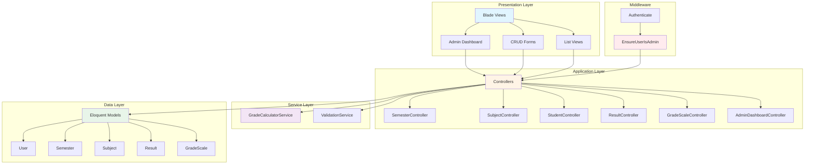
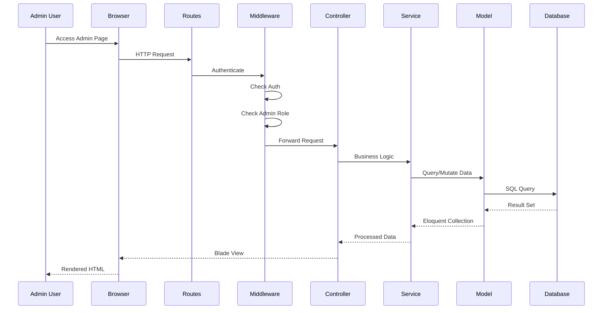
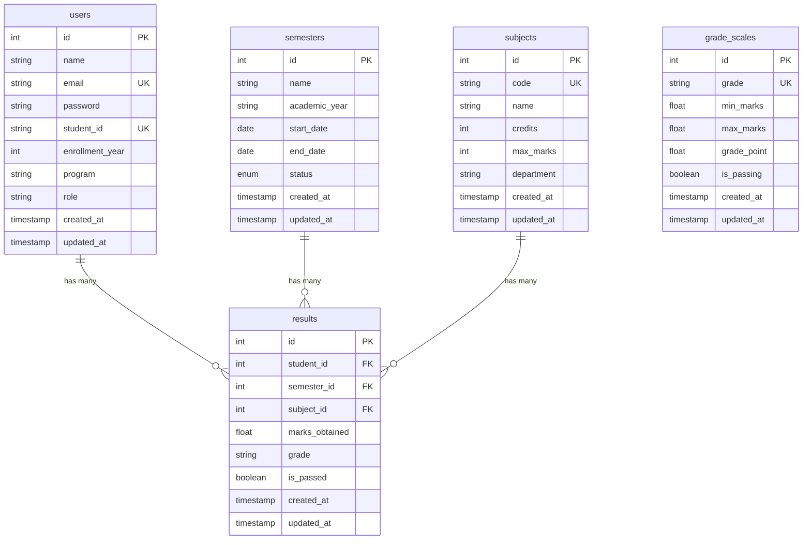
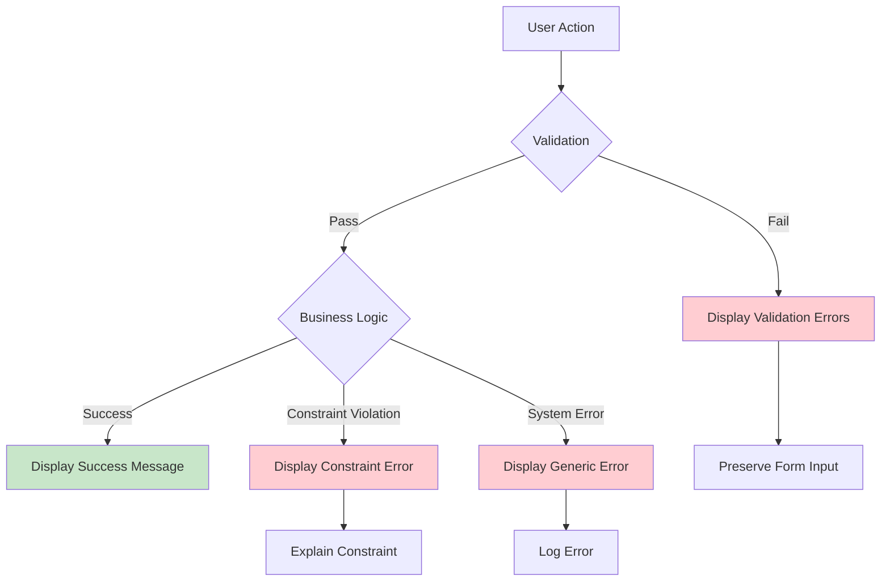

# Design Document: Admin CRUD Management System

## Overview

The Admin CRUD Management System provides a comprehensive web-based interface for professors and administrators to manage all aspects of the examination management system. This feature extends the existing Laravel application with five dedicated CRUD modules for managing Semesters, Subjects, Students, Results, and Grade Scales. The system enforces role-based access control, maintains data integrity through validation and referential constraints, and provides search, filtering, and pagination capabilities for efficient data management.

### Key Design Goals

1. **Security First**: All admin routes protected by authentication and authorization middleware
2. **Data Integrity**: Comprehensive validation and referential integrity enforcement
3. **User Experience**: Intuitive interface with clear feedback, search, and pagination
4. **Consistency**: Seamless integration with existing UI patterns and Laravel conventions
5. **Maintainability**: Clean separation of concerns using Laravel best practices

### Technology Stack

- **Framework**: Laravel 10.x
- **Database**: SQLite (existing)
- **Frontend**: Blade templates with Tailwind CSS
- **Authentication**: Laravel's built-in authentication system
- **Validation**: Laravel Form Request classes
- **ORM**: Eloquent with existing models

## Architecture

### High-Level Architecture



### Request Flow



### Component Responsibilities

| Component | Responsibility |
|-----------|---------------|
| **Routes** | Define URL patterns and map to controllers with middleware |
| **Middleware** | Enforce authentication and authorization |
| **Controllers** | Handle HTTP requests, coordinate services, return responses |
| **Form Requests** | Validate and authorize incoming form data |
| **Services** | Encapsulate business logic (grade calculation, validation) |
| **Models** | Represent database entities and relationships |
| **Views** | Render HTML using Blade templates |
| **Components** | Reusable UI elements (forms, tables, notifications) |

## Components and Interfaces

### Controller Design

All controllers follow Laravel Resource Controller conventions with standard CRUD methods.

#### Base Controller Structure

```php
namespace App\Http\Controllers\Admin;

use App\Http\Controllers\Controller;
use Illuminate\Http\Request;

abstract class AdminBaseController extends Controller
{
    protected string $viewPrefix;
    protected string $routePrefix;
    protected string $entityName;
    
    // Common methods for all admin controllers
    protected function redirectWithSuccess(string $message);
    protected function redirectWithError(string $message);
    protected function applySearch($query, Request $request);
}
```

#### 1. SemesterController

**Purpose**: Manage semester CRUD operations

**Methods**:
- `index()`: Display paginated list of semesters with search
- `create()`: Show create semester form
- `store(StoreSemesterRequest $request)`: Create new semester
- `show(Semester $semester)`: Display semester details
- `edit(Semester $semester)`: Show edit semester form
- `update(UpdateSemesterRequest $request, Semester $semester)`: Update semester
- `destroy(Semester $semester)`: Delete semester (with constraint checking)

**Key Logic**:
- Validate date ranges (start_date < end_date)
- Validate academic_year format (YYYY-YYYY)
- Check for associated results before deletion
- Search by name or academic_year

#### 2. SubjectController

**Purpose**: Manage subject CRUD operations

**Methods**:
- `index()`: Display paginated list of subjects with search
- `create()`: Show create subject form
- `store(StoreSubjectRequest $request)`: Create new subject
- `show(Subject $subject)`: Display subject details
- `edit(Subject $subject)`: Show edit subject form
- `update(UpdateSubjectRequest $request, Subject $subject)`: Update subject
- `destroy(Subject $subject)`: Delete subject (with constraint checking)

**Key Logic**:
- Enforce unique subject codes
- Validate credits (1-10) and max_marks (1-1000)
- Check for associated results before deletion
- Search by code, name, or department

#### 3. StudentController

**Purpose**: Manage student user accounts

**Methods**:
- `index()`: Display paginated list of students with search
- `create()`: Show create student form
- `store(StoreStudentRequest $request)`: Create new student
- `show(User $student)`: Display student details
- `edit(User $student)`: Show edit student form
- `update(UpdateStudentRequest $request, User $student)`: Update student
- `destroy(User $student)`: Delete student (with constraint checking)

**Key Logic**:
- Hash passwords using bcrypt
- Enforce unique email and student_id
- Set role to 'student' automatically
- Validate enrollment_year range
- Check for associated results before deletion
- Search by name, email, or student_id

#### 4. ResultController

**Purpose**: Manage examination results with automatic grade calculation

**Methods**:
- `index()`: Display paginated list of results with search
- `create()`: Show create result form with dropdowns
- `store(StoreResultRequest $request)`: Create new result with grade calculation
- `show(Result $result)`: Display result details
- `edit(Result $result)`: Show edit result form
- `update(UpdateResultRequest $request, Result $result)`: Update result with grade recalculation
- `destroy(Result $result)`: Delete result

**Key Logic**:
- Calculate grade using GradeScale model
- Set is_passed flag based on grade
- Enforce unique combination of student_id, semester_id, subject_id
- Validate marks_obtained against subject's max_marks
- Eager load relationships for display
- Search by student name, subject name, or semester name

#### 5. GradeScaleController

**Purpose**: Manage grading scale configuration

**Methods**:
- `index()`: Display paginated list of grade scales
- `create()`: Show create grade scale form
- `store(StoreGradeScaleRequest $request)`: Create new grade scale entry
- `show(GradeScale $gradeScale)`: Display grade scale details
- `edit(GradeScale $gradeScale)`: Show edit grade scale form
- `update(UpdateGradeScaleRequest $request, GradeScale $gradeScale)`: Update grade scale
- `destroy(GradeScale $gradeScale)`: Delete grade scale entry

**Key Logic**:
- Enforce unique grade letters
- Validate min_marks <= max_marks
- Validate marks range (0-100)
- Validate grade_point range (0.0-10.0)
- Check for overlapping marks ranges
- Search by grade letter

#### 6. AdminDashboardController

**Purpose**: Display admin dashboard with statistics and navigation

**Methods**:
- `index()`: Display dashboard with entity counts and recent activity

**Key Logic**:
- Count total records for each entity type
- Display recent results
- Provide navigation to all CRUD sections

### Form Request Classes

Each controller uses dedicated Form Request classes for validation.

#### StoreSemesterRequest

```php
public function rules(): array
{
    return [
        'name' => 'required|string|max:255',
        'academic_year' => ['required', 'regex:/^\d{4}-\d{4}$/'],
        'start_date' => 'required|date',
        'end_date' => 'required|date|after:start_date',
        'status' => ['required', Rule::in(['upcoming', 'current', 'completed'])],
    ];
}
```

#### StoreSubjectRequest

```php
public function rules(): array
{
    return [
        'code' => 'required|string|max:20|unique:subjects,code',
        'name' => 'required|string|max:255',
        'credits' => 'required|integer|min:1|max:10',
        'max_marks' => 'required|integer|min:1|max:1000',
        'department' => 'required|string|max:255',
    ];
}
```

#### StoreStudentRequest

```php
public function rules(): array
{
    return [
        'name' => 'required|string|max:255',
        'email' => 'required|email|unique:users,email',
        'student_id' => 'required|string|max:50|unique:users,student_id',
        'enrollment_year' => 'required|integer|min:1900|max:' . (date('Y') + 10),
        'program' => 'required|string|max:255',
        'password' => 'required|string|min:8|confirmed',
    ];
}
```

#### StoreResultRequest

```php
public function rules(): array
{
    return [
        'student_id' => 'required|exists:users,id',
        'semester_id' => 'required|exists:semesters,id',
        'subject_id' => 'required|exists:subjects,id',
        'marks_obtained' => [
            'required',
            'numeric',
            'min:0',
            function ($attribute, $value, $fail) {
                $subject = Subject::find($this->subject_id);
                if ($subject && $value > $subject->max_marks) {
                    $fail("Marks cannot exceed {$subject->max_marks}");
                }
            },
        ],
    ];
}

public function withValidator($validator)
{
    $validator->after(function ($validator) {
        // Check for duplicate result
        $exists = Result::where('student_id', $this->student_id)
            ->where('semester_id', $this->semester_id)
            ->where('subject_id', $this->subject_id)
            ->exists();
            
        if ($exists) {
            $validator->errors()->add('duplicate', 'Result already exists for this combination');
        }
    });
}
```

#### StoreGradeScaleRequest

```php
public function rules(): array
{
    return [
        'grade' => 'required|string|max:5|unique:grade_scales,grade',
        'min_marks' => 'required|numeric|min:0|max:100',
        'max_marks' => 'required|numeric|min:0|max:100|gte:min_marks',
        'grade_point' => 'required|numeric|min:0|max:10',
        'is_passing' => 'required|boolean',
    ];
}

public function withValidator($validator)
{
    $validator->after(function ($validator) {
        // Check for overlapping ranges
        $overlaps = GradeScale::where(function ($query) {
            $query->whereBetween('min_marks', [$this->min_marks, $this->max_marks])
                  ->orWhereBetween('max_marks', [$this->min_marks, $this->max_marks]);
        })->exists();
        
        if ($overlaps) {
            $validator->errors()->add('overlap', 'Marks range overlaps with existing grade scale');
        }
    });
}
```

### Service Layer

#### GradeCalculatorService (Enhanced)

**Purpose**: Calculate grades based on GradeScale model

```php
class GradeCalculatorService
{
    public function calculateGradeFromMarks(float $marksObtained, int $maxMarks): array
    {
        $percentage = ($marksObtained / $maxMarks) * 100;
        
        $gradeScale = GradeScale::where('min_marks', '<=', $percentage)
            ->where('max_marks', '>=', $percentage)
            ->first();
        
        if (!$gradeScale) {
            throw new \Exception('No matching grade scale found for marks: ' . $percentage);
        }
        
        return [
            'grade' => $gradeScale->grade,
            'grade_point' => $gradeScale->grade_point,
            'is_passed' => $gradeScale->is_passing,
        ];
    }
    
    public function recalculateResultGrades(GradeScale $updatedGradeScale): int
    {
        // Recalculate all results affected by grade scale update
        $affectedResults = Result::with('subject')->get()->filter(function ($result) use ($updatedGradeScale) {
            $percentage = ($result->marks_obtained / $result->subject->max_marks) * 100;
            return $percentage >= $updatedGradeScale->min_marks 
                && $percentage <= $updatedGradeScale->max_marks;
        });
        
        foreach ($affectedResults as $result) {
            $gradeData = $this->calculateGradeFromMarks(
                $result->marks_obtained,
                $result->subject->max_marks
            );
            
            $result->update($gradeData);
        }
        
        return $affectedResults->count();
    }
}
```

## Data Models

### Existing Models (No Changes Required)

All five models already exist with appropriate relationships:

1. **User** (Student)
   - Fields: id, name, email, password, student_id, enrollment_year, program, role
   - Relationships: hasMany(Result), hasManyThrough(Semester)

2. **Semester**
   - Fields: id, name, academic_year, start_date, end_date, status
   - Relationships: hasMany(Result), belongsToMany(Subject)

3. **Subject**
   - Fields: id, code, name, credits, max_marks, department
   - Relationships: hasMany(Result)

4. **Result**
   - Fields: id, student_id, semester_id, subject_id, marks_obtained, grade, is_passed
   - Relationships: belongsTo(User), belongsTo(Semester), belongsTo(Subject)

5. **GradeScale**
   - Fields: id, grade, min_marks, max_marks, grade_point, is_passing
   - Methods: getGradeForMarks(), getGradePoint(), isPassing()

### Database Schema Diagram



### Referential Integrity Constraints

| Parent Table | Child Table | Constraint | Action on Delete |
|--------------|-------------|------------|------------------|
| users | results | student_id | Prevent (check in controller) |
| semesters | results | semester_id | Prevent (check in controller) |
| subjects | results | subject_id | Prevent (check in controller) |

**Implementation**: Controllers check for related records before deletion and display error messages if constraints would be violated.

## Error Handling

### Error Handling Strategy



### Error Types and Handling

#### 1. Validation Errors

**Source**: Form Request validation failures

**Handling**:
- Display inline error messages next to form fields
- Highlight invalid fields with red borders
- Preserve valid input values
- Return 422 status code

**Example**:
```php
// In Blade template
@error('email')
    <span class="text-red-600 text-sm">{{ $message }}</span>
@enderror
```

#### 2. Referential Integrity Errors

**Source**: Attempting to delete records with dependencies

**Handling**:
- Check for related records before deletion
- Display user-friendly error message
- Suggest alternative actions

**Example**:
```php
public function destroy(Semester $semester)
{
    if ($semester->results()->exists()) {
        return redirect()
            ->route('admin.semesters.index')
            ->with('error', 'Cannot delete semester with existing results. Delete results first.');
    }
    
    $semester->delete();
    return redirect()
        ->route('admin.semesters.index')
        ->with('success', 'Semester deleted successfully.');
}
```

#### 3. Unique Constraint Violations

**Source**: Duplicate email, student_id, subject code, etc.

**Handling**:
- Validate uniqueness in Form Request
- Display specific error message
- Highlight conflicting field

**Example**:
```php
'email' => 'required|email|unique:users,email,' . $this->user?->id
```

#### 4. Grade Calculation Errors

**Source**: No matching grade scale for marks

**Handling**:
- Catch exception in controller
- Display error message
- Suggest configuring grade scales

**Example**:
```php
try {
    $gradeData = $this->gradeCalculator->calculateGradeFromMarks(
        $request->marks_obtained,
        $subject->max_marks
    );
} catch (\Exception $e) {
    return redirect()
        ->back()
        ->withInput()
        ->with('error', 'Grade calculation failed: ' . $e->getMessage());
}
```

#### 5. System Errors

**Source**: Database errors, unexpected exceptions

**Handling**:
- Log error details
- Display generic user-friendly message
- Return 500 status code

**Example**:
```php
try {
    // Operation
} catch (\Exception $e) {
    \Log::error('Admin operation failed', [
        'error' => $e->getMessage(),
        'user' => auth()->id(),
    ]);
    
    return redirect()
        ->back()
        ->with('error', 'An error occurred. Please try again.');
}
```

### Notification System

**Flash Messages**: Using Laravel's session flash

```php
// Success
session()->flash('success', 'Record created successfully');

// Error
session()->flash('error', 'Operation failed');

// Info
session()->flash('info', 'Please note...');

// Warning
session()->flash('warning', 'Be careful...');
```

**Display Component** (Blade):
```blade
@if(session('success'))
    <div class="alert alert-success" x-data="{ show: true }" x-show="show" x-init="setTimeout(() => show = false, 5000)">
        {{ session('success') }}
    </div>
@endif

@if(session('error'))
    <div class="alert alert-error" x-data="{ show: true }" x-show="show">
        {{ session('error') }}
        <button @click="show = false">×</button>
    </div>
@endif
```

## Testing Strategy

### Testing Approach

This feature involves primarily CRUD operations with form validation, database interactions, and UI rendering. Property-based testing is **NOT applicable** for this feature because:

1. **Infrastructure Focus**: The feature is primarily about wiring up existing Laravel components (controllers, views, forms)
2. **CRUD Operations**: Simple create, read, update, delete operations with no complex transformation logic
3. **UI Rendering**: Blade templates and form displays are better tested with integration tests
4. **Configuration Validation**: Form validation rules are declarative and tested through example-based tests

### Testing Strategy

#### 1. Unit Tests

**Purpose**: Test individual components in isolation

**Coverage**:
- **GradeCalculatorService**: Test grade calculation logic with various mark ranges
- **Form Request Validation**: Test validation rules with valid and invalid inputs
- **Model Methods**: Test custom model methods (isAdmin(), getPercentageAttribute())

**Examples**:
```php
// Test grade calculation
public function test_calculates_grade_correctly()
{
    $gradeScale = GradeScale::factory()->create([
        'grade' => 'A',
        'min_marks' => 80,
        'max_marks' => 100,
        'grade_point' => 9.0,
        'is_passing' => true,
    ]);
    
    $service = new GradeCalculatorService();
    $result = $service->calculateGradeFromMarks(85, 100);
    
    $this->assertEquals('A', $result['grade']);
    $this->assertEquals(9.0, $result['grade_point']);
    $this->assertTrue($result['is_passed']);
}

// Test validation
public function test_rejects_invalid_email()
{
    $request = new StoreStudentRequest();
    $validator = Validator::make(
        ['email' => 'invalid-email'],
        $request->rules()
    );
    
    $this->assertTrue($validator->fails());
    $this->assertArrayHasKey('email', $validator->errors()->toArray());
}
```

#### 2. Feature Tests (Integration Tests)

**Purpose**: Test complete request-response cycles

**Coverage**:
- **Authentication/Authorization**: Verify middleware protection
- **CRUD Operations**: Test create, read, update, delete flows
- **Form Submissions**: Test valid and invalid form submissions
- **Search/Filter**: Test search and filter functionality
- **Pagination**: Test pagination behavior
- **Referential Integrity**: Test constraint enforcement

**Examples**:
```php
// Test admin authentication
public function test_guest_cannot_access_admin_pages()
{
    $response = $this->get(route('admin.dashboard'));
    $response->assertRedirect(route('login'));
}

public function test_student_cannot_access_admin_pages()
{
    $student = User::factory()->create(['role' => 'student']);
    $response = $this->actingAs($student)->get(route('admin.dashboard'));
    $response->assertStatus(403);
}

// Test CRUD operations
public function test_admin_can_create_semester()
{
    $admin = User::factory()->create(['role' => 'admin']);
    
    $response = $this->actingAs($admin)->post(route('admin.semesters.store'), [
        'name' => 'Fall 2024',
        'academic_year' => '2024-2025',
        'start_date' => '2024-09-01',
        'end_date' => '2024-12-31',
        'status' => 'upcoming',
    ]);
    
    $response->assertRedirect(route('admin.semesters.index'));
    $this->assertDatabaseHas('semesters', ['name' => 'Fall 2024']);
}

// Test referential integrity
public function test_cannot_delete_semester_with_results()
{
    $admin = User::factory()->create(['role' => 'admin']);
    $semester = Semester::factory()->create();
    Result::factory()->create(['semester_id' => $semester->id]);
    
    $response = $this->actingAs($admin)->delete(route('admin.semesters.destroy', $semester));
    
    $response->assertRedirect();
    $response->assertSessionHas('error');
    $this->assertDatabaseHas('semesters', ['id' => $semester->id]);
}

// Test search functionality
public function test_can_search_students_by_name()
{
    $admin = User::factory()->create(['role' => 'admin']);
    User::factory()->create(['name' => 'John Doe', 'role' => 'student']);
    User::factory()->create(['name' => 'Jane Smith', 'role' => 'student']);
    
    $response = $this->actingAs($admin)->get(route('admin.students.index', ['search' => 'John']));
    
    $response->assertSee('John Doe');
    $response->assertDontSee('Jane Smith');
}
```

#### 3. Browser Tests (Optional)

**Purpose**: Test UI interactions and JavaScript behavior

**Coverage**:
- Confirmation dialogs for delete operations
- Auto-dismissing notifications
- Form field highlighting
- Responsive design

**Tool**: Laravel Dusk

#### 4. Manual Testing Checklist

- [ ] All CRUD operations work for each entity
- [ ] Search and filter return correct results
- [ ] Pagination displays correct page counts
- [ ] Validation errors display correctly
- [ ] Success/error notifications appear and dismiss properly
- [ ] Referential integrity constraints are enforced
- [ ] Grade calculation works correctly
- [ ] UI is responsive on different screen sizes
- [ ] Admin middleware blocks non-admin users
- [ ] Forms preserve input on validation errors

### Test Data Setup

Use Laravel factories for test data:

```php
// In tests
Semester::factory()->count(20)->create();
Subject::factory()->count(15)->create();
User::factory()->count(50)->create(['role' => 'student']);
Result::factory()->count(100)->create();
GradeScale::factory()->count(7)->create();
```

### Continuous Integration

- Run tests on every commit
- Require passing tests before merge
- Generate code coverage reports
- Target: >80% code coverage for controllers and services


## Route Definitions

### Route Structure

All admin routes are grouped under the `/admin` prefix with authentication and admin middleware.

```php
// routes/web.php

use App\Http\Controllers\Admin\{
    AdminDashboardController,
    SemesterController,
    SubjectController,
    StudentController,
    ResultController as AdminResultController,
    GradeScaleController
};

Route::prefix('admin')
    ->name('admin.')
    ->middleware(['auth', 'admin'])
    ->group(function () {
        
        // Dashboard
        Route::get('/dashboard', [AdminDashboardController::class, 'index'])
            ->name('dashboard');
        
        // Semesters CRUD
        Route::resource('semesters', SemesterController::class);
        
        // Subjects CRUD
        Route::resource('subjects', SubjectController::class);
        
        // Students CRUD
        Route::resource('students', StudentController::class);
        
        // Results CRUD
        Route::resource('results', AdminResultController::class);
        
        // Grade Scales CRUD
        Route::resource('grade-scales', GradeScaleController::class);
    });
```

### Route List

| Method | URI | Name | Controller@Action |
|--------|-----|------|-------------------|
| GET | /admin/dashboard | admin.dashboard | AdminDashboardController@index |
| GET | /admin/semesters | admin.semesters.index | SemesterController@index |
| GET | /admin/semesters/create | admin.semesters.create | SemesterController@create |
| POST | /admin/semesters | admin.semesters.store | SemesterController@store |
| GET | /admin/semesters/{semester} | admin.semesters.show | SemesterController@show |
| GET | /admin/semesters/{semester}/edit | admin.semesters.edit | SemesterController@edit |
| PUT/PATCH | /admin/semesters/{semester} | admin.semesters.update | SemesterController@update |
| DELETE | /admin/semesters/{semester} | admin.semesters.destroy | SemesterController@destroy |
| GET | /admin/subjects | admin.subjects.index | SubjectController@index |
| GET | /admin/subjects/create | admin.subjects.create | SubjectController@create |
| POST | /admin/subjects | admin.subjects.store | SubjectController@store |
| GET | /admin/subjects/{subject} | admin.subjects.show | SubjectController@show |
| GET | /admin/subjects/{subject}/edit | admin.subjects.edit | SubjectController@edit |
| PUT/PATCH | /admin/subjects/{subject} | admin.subjects.update | SubjectController@update |
| DELETE | /admin/subjects/{subject} | admin.subjects.destroy | SubjectController@destroy |
| GET | /admin/students | admin.students.index | StudentController@index |
| GET | /admin/students/create | admin.students.create | StudentController@create |
| POST | /admin/students | admin.students.store | StudentController@store |
| GET | /admin/students/{student} | admin.students.show | StudentController@show |
| GET | /admin/students/{student}/edit | admin.students.edit | StudentController@edit |
| PUT/PATCH | /admin/students/{student} | admin.students.update | StudentController@update |
| DELETE | /admin/students/{student} | admin.students.destroy | StudentController@destroy |
| GET | /admin/results | admin.results.index | AdminResultController@index |
| GET | /admin/results/create | admin.results.create | AdminResultController@create |
| POST | /admin/results | admin.results.store | AdminResultController@store |
| GET | /admin/results/{result} | admin.results.show | AdminResultController@show |
| GET | /admin/results/{result}/edit | admin.results.edit | AdminResultController@edit |
| PUT/PATCH | /admin/results/{result} | admin.results.update | AdminResultController@update |
| DELETE | /admin/results/{result} | admin.results.destroy | AdminResultController@destroy |
| GET | /admin/grade-scales | admin.grade-scales.index | GradeScaleController@index |
| GET | /admin/grade-scales/create | admin.grade-scales.create | GradeScaleController@create |
| POST | /admin/grade-scales | admin.grade-scales.store | GradeScaleController@store |
| GET | /admin/grade-scales/{gradeScale} | admin.grade-scales.show | GradeScaleController@show |
| GET | /admin/grade-scales/{gradeScale}/edit | admin.grade-scales.edit | GradeScaleController@edit |
| PUT/PATCH | /admin/grade-scales/{gradeScale} | admin.grade-scales.update | GradeScaleController@update |
| DELETE | /admin/grade-scales/{gradeScale} | admin.grade-scales.destroy | GradeScaleController@destroy |

### Middleware Registration

```php
// app/Http/Kernel.php

protected $middlewareAliases = [
    // ... existing middleware
    'admin' => \App\Http\Middleware\EnsureUserIsAdmin::class,
];
```

## View Structure

### Directory Organization

```
resources/views/
├── admin/
│   ├── layouts/
│   │   ├── app.blade.php          # Main admin layout
│   │   └── navigation.blade.php   # Admin navigation sidebar
│   ├── components/
│   │   ├── alert.blade.php        # Notification alerts
│   │   ├── breadcrumb.blade.php   # Breadcrumb navigation
│   │   ├── table.blade.php        # Data table component
│   │   ├── pagination.blade.php   # Pagination component
│   │   ├── search-bar.blade.php   # Search input component
│   │   ├── form-input.blade.php   # Form input field
│   │   ├── form-select.blade.php  # Form select dropdown
│   │   └── delete-modal.blade.php # Delete confirmation modal
│   ├── dashboard.blade.php        # Admin dashboard
│   ├── semesters/
│   │   ├── index.blade.php        # List semesters
│   │   ├── create.blade.php       # Create semester form
│   │   ├── edit.blade.php         # Edit semester form
│   │   └── show.blade.php         # Semester details
│   ├── subjects/
│   │   ├── index.blade.php
│   │   ├── create.blade.php
│   │   ├── edit.blade.php
│   │   └── show.blade.php
│   ├── students/
│   │   ├── index.blade.php
│   │   ├── create.blade.php
│   │   ├── edit.blade.php
│   │   └── show.blade.php
│   ├── results/
│   │   ├── index.blade.php
│   │   ├── create.blade.php
│   │   ├── edit.blade.php
│   │   └── show.blade.php
│   └── grade-scales/
│       ├── index.blade.php
│       ├── create.blade.php
│       ├── edit.blade.php
│       └── show.blade.php
```

### Layout Structure

#### Main Admin Layout (admin/layouts/app.blade.php)

```blade
<!DOCTYPE html>
<html lang="en">
<head>
    <meta charset="UTF-8">
    <meta name="viewport" content="width=device-width, initial-scale=1.0">
    <meta name="csrf-token" content="{{ csrf_token() }}">
    <title>@yield('title', 'Admin Panel') - Examination System</title>
    @vite(['resources/css/app.css', 'resources/js/app.js'])
</head>
<body class="bg-gray-100">
    <div class="flex h-screen">
        <!-- Sidebar Navigation -->
        @include('admin.layouts.navigation')
        
        <!-- Main Content -->
        <div class="flex-1 flex flex-col overflow-hidden">
            <!-- Top Header -->
            <header class="bg-white shadow-sm">
                <div class="px-6 py-4 flex justify-between items-center">
                    <h1 class="text-2xl font-semibold text-gray-800">
                        @yield('header', 'Admin Panel')
                    </h1>
                    <div class="flex items-center space-x-4">
                        <span class="text-gray-600">{{ auth()->user()->name }}</span>
                        <form method="POST" action="{{ route('logout') }}">
                            @csrf
                            <button type="submit" class="text-red-600 hover:text-red-800">
                                Logout
                            </button>
                        </form>
                    </div>
                </div>
            </header>
            
            <!-- Breadcrumb -->
            @if(isset($breadcrumbs))
                <x-admin.breadcrumb :items="$breadcrumbs" />
            @endif
            
            <!-- Alerts -->
            <x-admin.alert />
            
            <!-- Page Content -->
            <main class="flex-1 overflow-y-auto p-6">
                @yield('content')
            </main>
        </div>
    </div>
</body>
</html>
```

#### Navigation Sidebar (admin/layouts/navigation.blade.php)

```blade
<aside class="w-64 bg-gray-800 text-white">
    <div class="p-6">
        <h2 class="text-xl font-bold">Admin Panel</h2>
    </div>
    
    <nav class="mt-6">
        <a href="{{ route('admin.dashboard') }}" 
           class="block px-6 py-3 hover:bg-gray-700 {{ request()->routeIs('admin.dashboard') ? 'bg-gray-700' : '' }}">
            <i class="fas fa-dashboard mr-2"></i> Dashboard
        </a>
        
        <a href="{{ route('admin.semesters.index') }}" 
           class="block px-6 py-3 hover:bg-gray-700 {{ request()->routeIs('admin.semesters.*') ? 'bg-gray-700' : '' }}">
            <i class="fas fa-calendar mr-2"></i> Semesters
        </a>
        
        <a href="{{ route('admin.subjects.index') }}" 
           class="block px-6 py-3 hover:bg-gray-700 {{ request()->routeIs('admin.subjects.*') ? 'bg-gray-700' : '' }}">
            <i class="fas fa-book mr-2"></i> Subjects
        </a>
        
        <a href="{{ route('admin.students.index') }}" 
           class="block px-6 py-3 hover:bg-gray-700 {{ request()->routeIs('admin.students.*') ? 'bg-gray-700' : '' }}">
            <i class="fas fa-users mr-2"></i> Students
        </a>
        
        <a href="{{ route('admin.results.index') }}" 
           class="block px-6 py-3 hover:bg-gray-700 {{ request()->routeIs('admin.results.*') ? 'bg-gray-700' : '' }}">
            <i class="fas fa-chart-bar mr-2"></i> Results
        </a>
        
        <a href="{{ route('admin.grade-scales.index') }}" 
           class="block px-6 py-3 hover:bg-gray-700 {{ request()->routeIs('admin.grade-scales.*') ? 'bg-gray-700' : '' }}">
            <i class="fas fa-graduation-cap mr-2"></i> Grade Scales
        </a>
        
        <hr class="my-4 border-gray-700">
        
        <a href="{{ route('dashboard') }}" class="block px-6 py-3 hover:bg-gray-700">
            <i class="fas fa-arrow-left mr-2"></i> Student View
        </a>
    </nav>
</aside>
```

### View Templates

#### Index View Pattern (admin/semesters/index.blade.php)

```blade
@extends('admin.layouts.app')

@section('title', 'Semesters')
@section('header', 'Manage Semesters')

@section('content')
<div class="bg-white rounded-lg shadow">
    <!-- Header with Search and Create Button -->
    <div class="p-6 border-b border-gray-200">
        <div class="flex justify-between items-center">
            <x-admin.search-bar 
                :action="route('admin.semesters.index')" 
                :value="request('search')"
                placeholder="Search semesters..." />
            
            <a href="{{ route('admin.semesters.create') }}" 
               class="bg-blue-600 text-white px-4 py-2 rounded hover:bg-blue-700">
                <i class="fas fa-plus mr-2"></i> Create Semester
            </a>
        </div>
    </div>
    
    <!-- Table -->
    <div class="overflow-x-auto">
        <table class="w-full">
            <thead class="bg-gray-50">
                <tr>
                    <th class="px-6 py-3 text-left text-xs font-medium text-gray-500 uppercase">Name</th>
                    <th class="px-6 py-3 text-left text-xs font-medium text-gray-500 uppercase">Academic Year</th>
                    <th class="px-6 py-3 text-left text-xs font-medium text-gray-500 uppercase">Start Date</th>
                    <th class="px-6 py-3 text-left text-xs font-medium text-gray-500 uppercase">End Date</th>
                    <th class="px-6 py-3 text-left text-xs font-medium text-gray-500 uppercase">Status</th>
                    <th class="px-6 py-3 text-right text-xs font-medium text-gray-500 uppercase">Actions</th>
                </tr>
            </thead>
            <tbody class="divide-y divide-gray-200">
                @forelse($semesters as $semester)
                <tr class="hover:bg-gray-50">
                    <td class="px-6 py-4">{{ $semester->name }}</td>
                    <td class="px-6 py-4">{{ $semester->academic_year }}</td>
                    <td class="px-6 py-4">{{ $semester->start_date->format('M d, Y') }}</td>
                    <td class="px-6 py-4">{{ $semester->end_date->format('M d, Y') }}</td>
                    <td class="px-6 py-4">
                        <span class="px-2 py-1 text-xs rounded 
                            {{ $semester->status->value === 'current' ? 'bg-green-100 text-green-800' : 'bg-gray-100 text-gray-800' }}">
                            {{ ucfirst($semester->status->value) }}
                        </span>
                    </td>
                    <td class="px-6 py-4 text-right space-x-2">
                        <a href="{{ route('admin.semesters.show', $semester) }}" 
                           class="text-blue-600 hover:text-blue-800">View</a>
                        <a href="{{ route('admin.semesters.edit', $semester) }}" 
                           class="text-yellow-600 hover:text-yellow-800">Edit</a>
                        <button onclick="confirmDelete({{ $semester->id }})" 
                                class="text-red-600 hover:text-red-800">Delete</button>
                    </td>
                </tr>
                @empty
                <tr>
                    <td colspan="6" class="px-6 py-4 text-center text-gray-500">
                        No semesters found.
                    </td>
                </tr>
                @endforelse
            </tbody>
        </table>
    </div>
    
    <!-- Pagination -->
    <div class="p-6 border-t border-gray-200">
        {{ $semesters->links() }}
    </div>
</div>

<!-- Delete Confirmation Modal -->
<x-admin.delete-modal 
    entity="semester" 
    :route="route('admin.semesters.destroy', ':id')" />
@endsection
```

#### Create/Edit Form Pattern (admin/semesters/create.blade.php)

```blade
@extends('admin.layouts.app')

@section('title', 'Create Semester')
@section('header', 'Create New Semester')

@section('content')
<div class="max-w-2xl mx-auto">
    <div class="bg-white rounded-lg shadow p-6">
        <form method="POST" action="{{ route('admin.semesters.store') }}">
            @csrf
            
            <!-- Name -->
            <x-admin.form-input 
                name="name" 
                label="Semester Name" 
                :value="old('name')" 
                required />
            
            <!-- Academic Year -->
            <x-admin.form-input 
                name="academic_year" 
                label="Academic Year" 
                :value="old('academic_year')" 
                placeholder="2024-2025"
                required />
            
            <!-- Start Date -->
            <x-admin.form-input 
                name="start_date" 
                label="Start Date" 
                type="date"
                :value="old('start_date')" 
                required />
            
            <!-- End Date -->
            <x-admin.form-input 
                name="end_date" 
                label="End Date" 
                type="date"
                :value="old('end_date')" 
                required />
            
            <!-- Status -->
            <x-admin.form-select 
                name="status" 
                label="Status" 
                :options="[
                    'upcoming' => 'Upcoming',
                    'current' => 'Current',
                    'completed' => 'Completed'
                ]"
                :selected="old('status')"
                required />
            
            <!-- Buttons -->
            <div class="flex justify-end space-x-4 mt-6">
                <a href="{{ route('admin.semesters.index') }}" 
                   class="px-4 py-2 border border-gray-300 rounded hover:bg-gray-50">
                    Cancel
                </a>
                <button type="submit" 
                        class="px-4 py-2 bg-blue-600 text-white rounded hover:bg-blue-700">
                    Create Semester
                </button>
            </div>
        </form>
    </div>
</div>
@endsection
```

## UI Components

### Reusable Blade Components

#### 1. Alert Component (admin/components/alert.blade.php)

```blade
@if(session('success'))
<div x-data="{ show: true }" 
     x-show="show" 
     x-init="setTimeout(() => show = false, 5000)"
     class="bg-green-100 border border-green-400 text-green-700 px-4 py-3 rounded relative mb-4">
    <span class="block sm:inline">{{ session('success') }}</span>
    <button @click="show = false" class="absolute top-0 right-0 px-4 py-3">
        <span class="text-2xl">&times;</span>
    </button>
</div>
@endif

@if(session('error'))
<div x-data="{ show: true }" 
     x-show="show"
     class="bg-red-100 border border-red-400 text-red-700 px-4 py-3 rounded relative mb-4">
    <span class="block sm:inline">{{ session('error') }}</span>
    <button @click="show = false" class="absolute top-0 right-0 px-4 py-3">
        <span class="text-2xl">&times;</span>
    </button>
</div>
@endif
```

#### 2. Form Input Component (admin/components/form-input.blade.php)

```blade
@props([
    'name',
    'label',
    'type' => 'text',
    'value' => '',
    'placeholder' => '',
    'required' => false
])

<div class="mb-4">
    <label for="{{ $name }}" class="block text-sm font-medium text-gray-700 mb-2">
        {{ $label }}
        @if($required)
            <span class="text-red-500">*</span>
        @endif
    </label>
    
    <input 
        type="{{ $type }}"
        name="{{ $name }}"
        id="{{ $name }}"
        value="{{ $value }}"
        placeholder="{{ $placeholder }}"
        {{ $required ? 'required' : '' }}
        class="w-full px-3 py-2 border border-gray-300 rounded focus:outline-none focus:ring-2 focus:ring-blue-500 
               @error($name) border-red-500 @enderror">
    
    @error($name)
        <p class="mt-1 text-sm text-red-600">{{ $message }}</p>
    @enderror
</div>
```

#### 3. Form Select Component (admin/components/form-select.blade.php)

```blade
@props([
    'name',
    'label',
    'options' => [],
    'selected' => '',
    'required' => false
])

<div class="mb-4">
    <label for="{{ $name }}" class="block text-sm font-medium text-gray-700 mb-2">
        {{ $label }}
        @if($required)
            <span class="text-red-500">*</span>
        @endif
    </label>
    
    <select 
        name="{{ $name }}"
        id="{{ $name }}"
        {{ $required ? 'required' : '' }}
        class="w-full px-3 py-2 border border-gray-300 rounded focus:outline-none focus:ring-2 focus:ring-blue-500 
               @error($name) border-red-500 @enderror">
        <option value="">Select {{ $label }}</option>
        @foreach($options as $value => $text)
            <option value="{{ $value }}" {{ $selected == $value ? 'selected' : '' }}>
                {{ $text }}
            </option>
        @endforeach
    </select>
    
    @error($name)
        <p class="mt-1 text-sm text-red-600">{{ $message }}</p>
    @enderror
</div>
```

#### 4. Search Bar Component (admin/components/search-bar.blade.php)

```blade
@props([
    'action',
    'value' => '',
    'placeholder' => 'Search...'
])

<form method="GET" action="{{ $action }}" class="flex items-center">
    <input 
        type="text" 
        name="search" 
        value="{{ $value }}"
        placeholder="{{ $placeholder }}"
        class="px-4 py-2 border border-gray-300 rounded-l focus:outline-none focus:ring-2 focus:ring-blue-500">
    <button type="submit" class="px-4 py-2 bg-gray-600 text-white rounded-r hover:bg-gray-700">
        <i class="fas fa-search"></i>
    </button>
</form>
```

#### 5. Delete Modal Component (admin/components/delete-modal.blade.php)

```blade
@props(['entity', 'route'])

<div id="deleteModal" class="hidden fixed inset-0 bg-gray-600 bg-opacity-50 overflow-y-auto h-full w-full z-50">
    <div class="relative top-20 mx-auto p-5 border w-96 shadow-lg rounded-md bg-white">
        <div class="mt-3 text-center">
            <div class="mx-auto flex items-center justify-center h-12 w-12 rounded-full bg-red-100">
                <i class="fas fa-exclamation-triangle text-red-600 text-2xl"></i>
            </div>
            <h3 class="text-lg leading-6 font-medium text-gray-900 mt-4">Delete {{ ucfirst($entity) }}</h3>
            <div class="mt-2 px-7 py-3">
                <p class="text-sm text-gray-500">
                    Are you sure you want to delete this {{ $entity }}? This action cannot be undone.
                </p>
            </div>
            <div class="flex justify-center space-x-4 mt-4">
                <button onclick="closeDeleteModal()" 
                        class="px-4 py-2 bg-gray-300 text-gray-800 rounded hover:bg-gray-400">
                    Cancel
                </button>
                <form id="deleteForm" method="POST" action="">
                    @csrf
                    @method('DELETE')
                    <button type="submit" 
                            class="px-4 py-2 bg-red-600 text-white rounded hover:bg-red-700">
                        Delete
                    </button>
                </form>
            </div>
        </div>
    </div>
</div>

<script>
function confirmDelete(id) {
    const modal = document.getElementById('deleteModal');
    const form = document.getElementById('deleteForm');
    form.action = '{{ $route }}'.replace(':id', id);
    modal.classList.remove('hidden');
}

function closeDeleteModal() {
    document.getElementById('deleteModal').classList.add('hidden');
}
</script>
```

### Tailwind CSS Styling Patterns

#### Color Scheme

- **Primary**: Blue (bg-blue-600, text-blue-600)
- **Success**: Green (bg-green-600, text-green-600)
- **Warning**: Yellow (bg-yellow-600, text-yellow-600)
- **Danger**: Red (bg-red-600, text-red-600)
- **Neutral**: Gray (bg-gray-100, text-gray-600)

#### Button Styles

```html
<!-- Primary Button -->
<button class="px-4 py-2 bg-blue-600 text-white rounded hover:bg-blue-700 focus:outline-none focus:ring-2 focus:ring-blue-500">
    Primary Action
</button>

<!-- Secondary Button -->
<button class="px-4 py-2 border border-gray-300 rounded hover:bg-gray-50 focus:outline-none focus:ring-2 focus:ring-gray-500">
    Secondary Action
</button>

<!-- Danger Button -->
<button class="px-4 py-2 bg-red-600 text-white rounded hover:bg-red-700 focus:outline-none focus:ring-2 focus:ring-red-500">
    Delete
</button>
```

#### Form Styles

```html
<!-- Input Field -->
<input class="w-full px-3 py-2 border border-gray-300 rounded focus:outline-none focus:ring-2 focus:ring-blue-500">

<!-- Input with Error -->
<input class="w-full px-3 py-2 border border-red-500 rounded focus:outline-none focus:ring-2 focus:ring-red-500">

<!-- Select Dropdown -->
<select class="w-full px-3 py-2 border border-gray-300 rounded focus:outline-none focus:ring-2 focus:ring-blue-500">
```

#### Table Styles

```html
<table class="w-full">
    <thead class="bg-gray-50">
        <tr>
            <th class="px-6 py-3 text-left text-xs font-medium text-gray-500 uppercase tracking-wider">
                Column Header
            </th>
        </tr>
    </thead>
    <tbody class="bg-white divide-y divide-gray-200">
        <tr class="hover:bg-gray-50">
            <td class="px-6 py-4 whitespace-nowrap">
                Cell Content
            </td>
        </tr>
    </tbody>
</table>
```

### Responsive Design Breakpoints

- **Mobile**: < 768px (sm:)
- **Tablet**: 768px - 1023px (md:)
- **Desktop**: ≥ 1024px (lg:)

**Responsive Patterns**:
```html
<!-- Stack on mobile, side-by-side on desktop -->
<div class="flex flex-col md:flex-row">

<!-- Hide on mobile, show on desktop -->
<div class="hidden lg:block">

<!-- Full width on mobile, half width on desktop -->
<div class="w-full lg:w-1/2">
```


## Search, Filter, and Pagination Implementation

### Search Implementation

#### Controller Search Logic

```php
public function index(Request $request)
{
    $query = Semester::query();
    
    // Apply search filter
    if ($search = $request->input('search')) {
        $query->where(function ($q) use ($search) {
            $q->where('name', 'like', "%{$search}%")
              ->orWhere('academic_year', 'like', "%{$search}%");
        });
    }
    
    // Apply sorting
    $query->orderBy('created_at', 'desc');
    
    // Paginate results
    $semesters = $query->paginate(15)->withQueryString();
    
    return view('admin.semesters.index', compact('semesters'));
}
```

#### Search Patterns by Entity

| Entity | Searchable Fields |
|--------|-------------------|
| Semesters | name, academic_year |
| Subjects | code, name, department |
| Students | name, email, student_id |
| Results | student.name, subject.name, semester.name (via relationships) |
| Grade Scales | grade |

#### Results Search with Relationships

```php
public function index(Request $request)
{
    $query = Result::with(['student', 'subject', 'semester']);
    
    if ($search = $request->input('search')) {
        $query->where(function ($q) use ($search) {
            $q->whereHas('student', function ($q) use ($search) {
                $q->where('name', 'like', "%{$search}%");
            })
            ->orWhereHas('subject', function ($q) use ($search) {
                $q->where('name', 'like', "%{$search}%");
            })
            ->orWhereHas('semester', function ($q) use ($search) {
                $q->where('name', 'like', "%{$search}%");
            });
        });
    }
    
    $results = $query->paginate(15)->withQueryString();
    
    return view('admin.results.index', compact('results'));
}
```

### Filter Implementation

#### Filter Dropdowns

For entities with categorical fields, provide filter dropdowns:

```php
// Semesters - Filter by status
public function index(Request $request)
{
    $query = Semester::query();
    
    if ($status = $request->input('status')) {
        $query->where('status', $status);
    }
    
    if ($search = $request->input('search')) {
        $query->where(function ($q) use ($search) {
            $q->where('name', 'like', "%{$search}%")
              ->orWhere('academic_year', 'like', "%{$search}%");
        });
    }
    
    $semesters = $query->paginate(15)->withQueryString();
    
    return view('admin.semesters.index', compact('semesters'));
}
```

```blade
<!-- In view -->
<form method="GET" action="{{ route('admin.semesters.index') }}" class="flex items-center space-x-4">
    <input type="text" name="search" value="{{ request('search') }}" 
           placeholder="Search..." class="px-4 py-2 border rounded">
    
    <select name="status" class="px-4 py-2 border rounded">
        <option value="">All Statuses</option>
        <option value="upcoming" {{ request('status') === 'upcoming' ? 'selected' : '' }}>Upcoming</option>
        <option value="current" {{ request('status') === 'current' ? 'selected' : '' }}>Current</option>
        <option value="completed" {{ request('status') === 'completed' ? 'selected' : '' }}>Completed</option>
    </select>
    
    <button type="submit" class="px-4 py-2 bg-blue-600 text-white rounded">Filter</button>
    <a href="{{ route('admin.semesters.index') }}" class="px-4 py-2 border rounded">Clear</a>
</form>
```

#### Subjects - Filter by Department

```php
public function index(Request $request)
{
    $query = Subject::query();
    
    if ($department = $request->input('department')) {
        $query->where('department', $department);
    }
    
    if ($search = $request->input('search')) {
        $query->where(function ($q) use ($search) {
            $q->where('code', 'like', "%{$search}%")
              ->orWhere('name', 'like', "%{$search}%")
              ->orWhere('department', 'like', "%{$search}%");
        });
    }
    
    // Get unique departments for filter dropdown
    $departments = Subject::distinct()->pluck('department');
    
    $subjects = $query->paginate(15)->withQueryString();
    
    return view('admin.subjects.index', compact('subjects', 'departments'));
}
```

### Pagination Implementation

#### Laravel Pagination

Laravel's built-in pagination is used with Tailwind CSS styling.

```php
// In controller
$items = $query->paginate(15)->withQueryString();
```

The `withQueryString()` method preserves search and filter parameters across pages.

#### Custom Pagination View

Create a custom pagination view for Tailwind CSS:

```blade
<!-- resources/views/vendor/pagination/tailwind.blade.php -->
@if ($paginator->hasPages())
    <nav role="navigation" aria-label="Pagination Navigation" class="flex items-center justify-between">
        <div class="flex justify-between flex-1 sm:hidden">
            @if ($paginator->onFirstPage())
                <span class="relative inline-flex items-center px-4 py-2 text-sm font-medium text-gray-500 bg-white border border-gray-300 cursor-default rounded-md">
                    Previous
                </span>
            @else
                <a href="{{ $paginator->previousPageUrl() }}" class="relative inline-flex items-center px-4 py-2 text-sm font-medium text-gray-700 bg-white border border-gray-300 rounded-md hover:bg-gray-50">
                    Previous
                </a>
            @endif

            @if ($paginator->hasMorePages())
                <a href="{{ $paginator->nextPageUrl() }}" class="relative inline-flex items-center px-4 py-2 ml-3 text-sm font-medium text-gray-700 bg-white border border-gray-300 rounded-md hover:bg-gray-50">
                    Next
                </a>
            @else
                <span class="relative inline-flex items-center px-4 py-2 ml-3 text-sm font-medium text-gray-500 bg-white border border-gray-300 cursor-default rounded-md">
                    Next
                </span>
            @endif
        </div>

        <div class="hidden sm:flex-1 sm:flex sm:items-center sm:justify-between">
            <div>
                <p class="text-sm text-gray-700">
                    Showing
                    <span class="font-medium">{{ $paginator->firstItem() }}</span>
                    to
                    <span class="font-medium">{{ $paginator->lastItem() }}</span>
                    of
                    <span class="font-medium">{{ $paginator->total() }}</span>
                    results
                </p>
            </div>

            <div>
                <span class="relative z-0 inline-flex shadow-sm rounded-md">
                    {{-- Previous Page Link --}}
                    @if ($paginator->onFirstPage())
                        <span aria-disabled="true" aria-label="Previous">
                            <span class="relative inline-flex items-center px-2 py-2 text-sm font-medium text-gray-500 bg-white border border-gray-300 cursor-default rounded-l-md" aria-hidden="true">
                                <svg class="w-5 h-5" fill="currentColor" viewBox="0 0 20 20">
                                    <path fill-rule="evenodd" d="M12.707 5.293a1 1 0 010 1.414L9.414 10l3.293 3.293a1 1 0 01-1.414 1.414l-4-4a1 1 0 010-1.414l4-4a1 1 0 011.414 0z" clip-rule="evenodd" />
                                </svg>
                            </span>
                        </span>
                    @else
                        <a href="{{ $paginator->previousPageUrl() }}" rel="prev" class="relative inline-flex items-center px-2 py-2 text-sm font-medium text-gray-500 bg-white border border-gray-300 rounded-l-md hover:bg-gray-50" aria-label="Previous">
                            <svg class="w-5 h-5" fill="currentColor" viewBox="0 0 20 20">
                                <path fill-rule="evenodd" d="M12.707 5.293a1 1 0 010 1.414L9.414 10l3.293 3.293a1 1 0 01-1.414 1.414l-4-4a1 1 0 010-1.414l4-4a1 1 0 011.414 0z" clip-rule="evenodd" />
                            </svg>
                        </a>
                    @endif

                    {{-- Pagination Elements --}}
                    @foreach ($elements as $element)
                        {{-- "Three Dots" Separator --}}
                        @if (is_string($element))
                            <span aria-disabled="true">
                                <span class="relative inline-flex items-center px-4 py-2 -ml-px text-sm font-medium text-gray-700 bg-white border border-gray-300 cursor-default">{{ $element }}</span>
                            </span>
                        @endif

                        {{-- Array Of Links --}}
                        @if (is_array($element))
                            @foreach ($element as $page => $url)
                                @if ($page == $paginator->currentPage())
                                    <span aria-current="page">
                                        <span class="relative inline-flex items-center px-4 py-2 -ml-px text-sm font-medium text-white bg-blue-600 border border-gray-300 cursor-default">{{ $page }}</span>
                                    </span>
                                @else
                                    <a href="{{ $url }}" class="relative inline-flex items-center px-4 py-2 -ml-px text-sm font-medium text-gray-700 bg-white border border-gray-300 hover:bg-gray-50" aria-label="Go to page {{ $page }}">
                                        {{ $page }}
                                    </a>
                                @endif
                            @endforeach
                        @endif
                    @endforeach

                    {{-- Next Page Link --}}
                    @if ($paginator->hasMorePages())
                        <a href="{{ $paginator->nextPageUrl() }}" rel="next" class="relative inline-flex items-center px-2 py-2 -ml-px text-sm font-medium text-gray-500 bg-white border border-gray-300 rounded-r-md hover:bg-gray-50" aria-label="Next">
                            <svg class="w-5 h-5" fill="currentColor" viewBox="0 0 20 20">
                                <path fill-rule="evenodd" d="M7.293 14.707a1 1 0 010-1.414L10.586 10 7.293 6.707a1 1 0 011.414-1.414l4 4a1 1 0 010 1.414l-4 4a1 1 0 01-1.414 0z" clip-rule="evenodd" />
                            </svg>
                        </a>
                    @else
                        <span aria-disabled="true" aria-label="Next">
                            <span class="relative inline-flex items-center px-2 py-2 -ml-px text-sm font-medium text-gray-500 bg-white border border-gray-300 cursor-default rounded-r-md" aria-hidden="true">
                                <svg class="w-5 h-5" fill="currentColor" viewBox="0 0 20 20">
                                    <path fill-rule="evenodd" d="M7.293 14.707a1 1 0 010-1.414L10.586 10 7.293 6.707a1 1 0 011.414-1.414l4 4a1 1 0 010 1.414l-4 4a1 1 0 01-1.414 0z" clip-rule="evenodd" />
                                </svg>
                            </span>
                        </span>
                    @endif
                </span>
            </div>
        </div>
    </nav>
@endif
```

#### Usage in Views

```blade
<div class="p-6 border-t border-gray-200">
    {{ $semesters->links() }}
</div>
```

### Performance Optimization

#### Eager Loading

Prevent N+1 query problems by eager loading relationships:

```php
// Results index - load all relationships
$results = Result::with(['student', 'subject', 'semester'])
    ->paginate(15);

// Subjects index - count related results
$subjects = Subject::withCount('results')
    ->paginate(15);
```

#### Database Indexes

Ensure indexes exist on frequently searched columns:

```php
// In migrations
$table->index('name');
$table->index('email');
$table->index('student_id');
$table->index('code');
$table->index('department');
```

#### Query Optimization

```php
// Use select() to limit columns when not all are needed
$students = User::select('id', 'name', 'email', 'student_id')
    ->where('role', 'student')
    ->paginate(15);

// Use chunk() for large datasets in background jobs
User::where('role', 'student')->chunk(100, function ($students) {
    // Process students in batches
});
```

## Implementation Checklist

### Phase 1: Foundation (Controllers & Routes)

- [ ] Create SemesterController with all CRUD methods
- [ ] Create SubjectController with all CRUD methods
- [ ] Create StudentController with all CRUD methods
- [ ] Create ResultController with all CRUD methods
- [ ] Create GradeScaleController with all CRUD methods
- [ ] Update AdminDashboardController with entity counts
- [ ] Register all routes in web.php with admin middleware
- [ ] Register admin middleware alias in Kernel.php

### Phase 2: Form Requests (Validation)

- [ ] Create StoreSemesterRequest
- [ ] Create UpdateSemesterRequest
- [ ] Create StoreSubjectRequest
- [ ] Create UpdateSubjectRequest
- [ ] Create StoreStudentRequest
- [ ] Create UpdateStudentRequest
- [ ] Create StoreResultRequest
- [ ] Create UpdateResultRequest
- [ ] Create StoreGradeScaleRequest
- [ ] Create UpdateGradeScaleRequest

### Phase 3: Services

- [ ] Enhance GradeCalculatorService with GradeScale integration
- [ ] Add calculateGradeFromMarks() method
- [ ] Add recalculateResultGrades() method
- [ ] Test grade calculation logic

### Phase 4: Views - Layouts

- [ ] Create admin/layouts/app.blade.php
- [ ] Create admin/layouts/navigation.blade.php
- [ ] Update admin/dashboard.blade.php with entity counts

### Phase 5: Views - Components

- [ ] Create admin/components/alert.blade.php
- [ ] Create admin/components/breadcrumb.blade.php
- [ ] Create admin/components/form-input.blade.php
- [ ] Create admin/components/form-select.blade.php
- [ ] Create admin/components/search-bar.blade.php
- [ ] Create admin/components/delete-modal.blade.php
- [ ] Create custom pagination view (vendor/pagination/tailwind.blade.php)

### Phase 6: Views - Semesters

- [ ] Create admin/semesters/index.blade.php
- [ ] Create admin/semesters/create.blade.php
- [ ] Create admin/semesters/edit.blade.php
- [ ] Create admin/semesters/show.blade.php

### Phase 7: Views - Subjects

- [ ] Create admin/subjects/index.blade.php
- [ ] Create admin/subjects/create.blade.php
- [ ] Create admin/subjects/edit.blade.php
- [ ] Create admin/subjects/show.blade.php

### Phase 8: Views - Students

- [ ] Create admin/students/index.blade.php
- [ ] Create admin/students/create.blade.php
- [ ] Create admin/students/edit.blade.php
- [ ] Create admin/students/show.blade.php

### Phase 9: Views - Results

- [ ] Create admin/results/index.blade.php
- [ ] Create admin/results/create.blade.php (with dropdowns for student, semester, subject)
- [ ] Create admin/results/edit.blade.php
- [ ] Create admin/results/show.blade.php

### Phase 10: Views - Grade Scales

- [ ] Create admin/grade-scales/index.blade.php
- [ ] Create admin/grade-scales/create.blade.php
- [ ] Create admin/grade-scales/edit.blade.php
- [ ] Create admin/grade-scales/show.blade.php

### Phase 11: Testing

- [ ] Write unit tests for GradeCalculatorService
- [ ] Write unit tests for Form Request validation rules
- [ ] Write feature tests for authentication/authorization
- [ ] Write feature tests for Semesters CRUD
- [ ] Write feature tests for Subjects CRUD
- [ ] Write feature tests for Students CRUD
- [ ] Write feature tests for Results CRUD
- [ ] Write feature tests for Grade Scales CRUD
- [ ] Write feature tests for search functionality
- [ ] Write feature tests for pagination
- [ ] Write feature tests for referential integrity constraints

### Phase 12: Integration & Polish

- [ ] Test all CRUD operations manually
- [ ] Test search and filter functionality
- [ ] Test pagination with large datasets
- [ ] Test responsive design on mobile/tablet/desktop
- [ ] Test error handling and validation messages
- [ ] Test referential integrity constraints
- [ ] Test grade calculation integration
- [ ] Verify UI consistency with existing application
- [ ] Performance testing with large datasets
- [ ] Security audit (middleware, validation, CSRF)

## Deployment Considerations

### Environment Configuration

No additional environment variables required. The feature uses existing database and authentication configuration.

### Database Migrations

No new migrations required. All tables already exist:
- users
- semesters
- subjects
- results
- grade_scales

### Asset Compilation

```bash
npm run build
```

Compile Tailwind CSS and JavaScript assets before deployment.

### Cache Clearing

```bash
php artisan config:clear
php artisan route:clear
php artisan view:clear
php artisan cache:clear
```

### Permissions

Ensure web server has write permissions for:
- storage/logs
- storage/framework/cache
- storage/framework/sessions
- storage/framework/views

### Performance Optimization

```bash
php artisan config:cache
php artisan route:cache
php artisan view:cache
```

Cache configuration, routes, and views in production.

## Security Considerations

### Authentication & Authorization

- All admin routes protected by `auth` and `admin` middleware
- EnsureUserIsAdmin middleware checks user role
- Unauthorized access returns 403 Forbidden

### Input Validation

- All form inputs validated server-side using Form Request classes
- SQL injection prevented by Eloquent ORM parameterized queries
- XSS prevented by Blade's automatic escaping

### CSRF Protection

- All forms include `@csrf` directive
- Laravel's VerifyCsrfToken middleware validates tokens
- AJAX requests must include CSRF token in headers

### Password Security

- Passwords hashed using bcrypt (Laravel default)
- Minimum 8 characters enforced
- Password confirmation required on creation

### Data Integrity

- Unique constraints enforced (email, student_id, subject code, grade)
- Foreign key references validated
- Referential integrity checked before deletion

### Error Handling

- Generic error messages for system errors (no sensitive info exposed)
- Detailed validation errors only for form fields
- Errors logged for debugging without exposing to users

## Maintenance & Support

### Logging

Laravel's logging system captures:
- Authentication failures
- Authorization failures
- Validation errors
- System exceptions

Logs stored in `storage/logs/laravel.log`

### Monitoring

Monitor:
- Failed login attempts
- 403 Forbidden responses (unauthorized access attempts)
- 500 Internal Server errors
- Database query performance
- Page load times

### Backup Strategy

Regular backups of:
- SQLite database file (`database/database.sqlite`)
- Uploaded files (if any)
- Environment configuration

### Update Procedures

1. Pull latest code from repository
2. Run migrations (if any): `php artisan migrate`
3. Clear caches: `php artisan cache:clear`
4. Compile assets: `npm run build`
5. Test in staging environment
6. Deploy to production

## Conclusion

This design document provides a comprehensive blueprint for implementing the Admin CRUD Management System. The design follows Laravel best practices, maintains consistency with the existing application, and ensures security, data integrity, and user experience are prioritized throughout the implementation.

The modular architecture allows for easy maintenance and future enhancements, while the thorough testing strategy ensures reliability and correctness of all CRUD operations.

